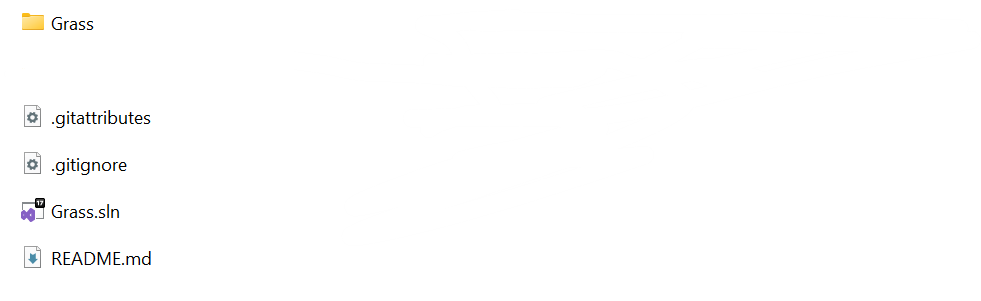
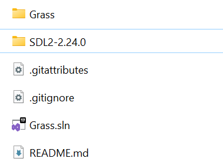

# Install Grass

<p style="text-align: center; border: 2.5px #b0a83c;; background-color: #fff654; border-radius: 10px;"> WARNING!<br>
Currently, the only OS we provide support for Grass are Windows, support for both the engine and games you build.</p><br>

First, have Git and Visual Studio installed. 
You must be sure that you have checked "Desktop Development for C++", otherwise you can't work with C++ on Visual Studio.  

We will also download SDL2 for engine to work, but we will show how under the way :)

## Installation:

First clone the GitHub source code of Grass engine by running this command: 

```sh
git clone https://github.com/nikeedev/grass.git
```

Inside Grass folder, the view should be something similar to this: 




#### SDL2

Now let's install SDL2, the library i use to make the engine work. 

Head over to [https://github.com/libsdl-org/SDL/releases/latest](https://github.com/libsdl-org/SDL/releases/latest) where you can download the latest (not development) version of SDL2.

Scroll down till you find the one we need that should have text like this: 


We need that specific type of SDL2 because it is build to work with and on Visual Studio. Unzip **SDL2-devel-2.x.x-VC.zip** and inside it you will find another folder with name: **SDL2-2.x.x**. Take this folder and paste it in the head Grass engine folder.

Your new folder view should look something like this:



Nice! Now the Grass engine is installed and setup'ed.

Let's go next and run it!
