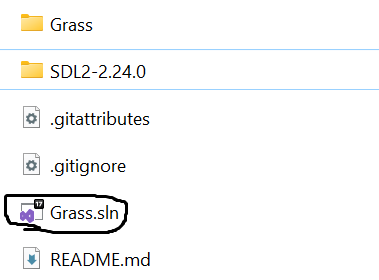
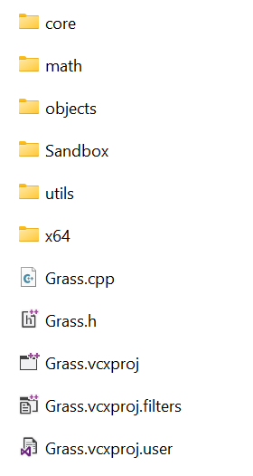

# Running Grass for first time

Now, let's try to run Grass Engine for the first time. 

It's fairly simple, begin by double clicking Grass.sln solution file: 

It should start up Visual Studio and get ready the project files inside the other "Grass" folder:

Now click at the top green run button and the demo game wil start up

